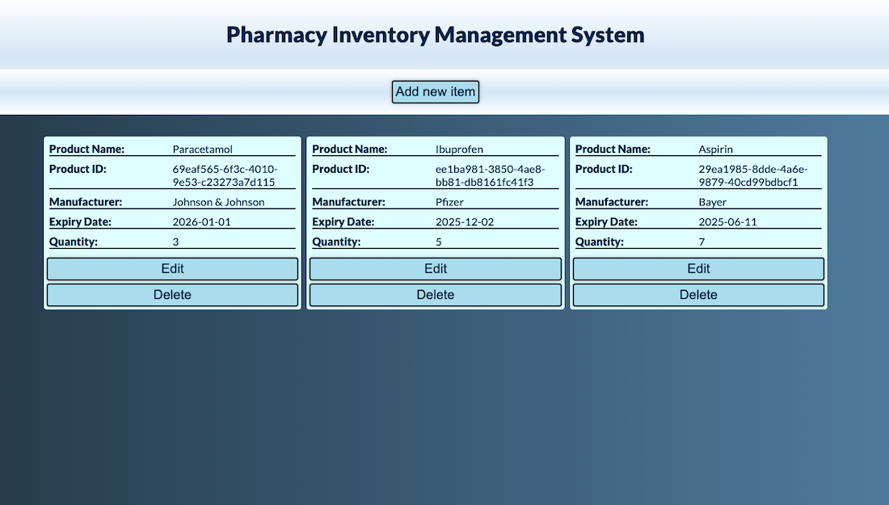

# Pharmacy Inventory Managment System



## Overview

A simple web-based tool to manage a medicines inventory. Users can add, edit, delete medicines with data stored in `localStorage`.

## Features

- Add, edit, and delete medicines.
- Persistent storage using `localStorage`.

## Installation

### Prerequisites

- [Node.js](https://nodejs.org/) & npm

### Steps

1. Clone the repository:
   ```sh
   git clone https://github.com/jerzyszajner/pharmacy-inventory-system.git
   cd pharmacy-inventory-system
   ```
2. Install dependencies:
   ```sh
   npm install
   ```
3. Run the development server:
   ```sh
   npm run dev
   ```

## Usage

1. Add item by filling in the details.
2. Auto-generated ID with UUIDv4.
3. Edit or delete item as needed.

## Credits

- **Inspiration**: A project inspired by the school project “Books App.”
- **GPT/AI**: Assisted with debugging

## Technologies Used

- **Frontend**: HTML, CSS, JavaScript
- **Storage**: `localStorage`
- **Build Tool**: Vite

## Testing

- **Browsers:** Google Chrome and Safari.
- **Devices:** iPhone 13 Pro Max.
- **Methods:** Manual testing and debugging using browser developer tools.

## License

See [License.txt](public/License.txt) for details.

## Netlify Deployment

[Live Project on Netlify](https://pharmacy-inventory-system.netlify.app//)
